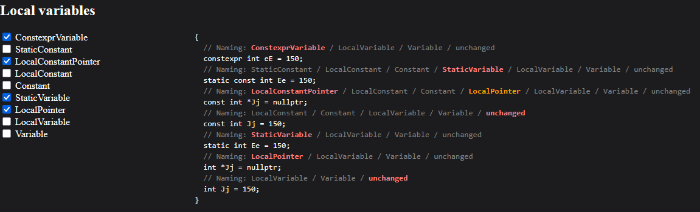
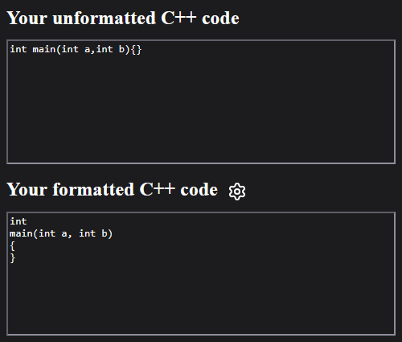
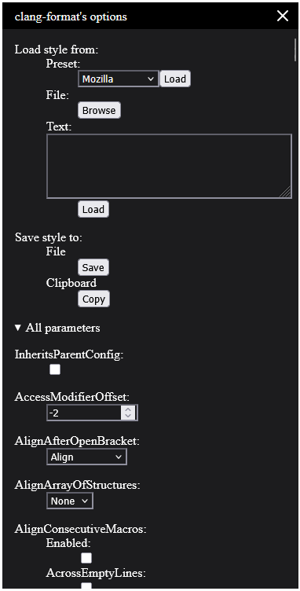
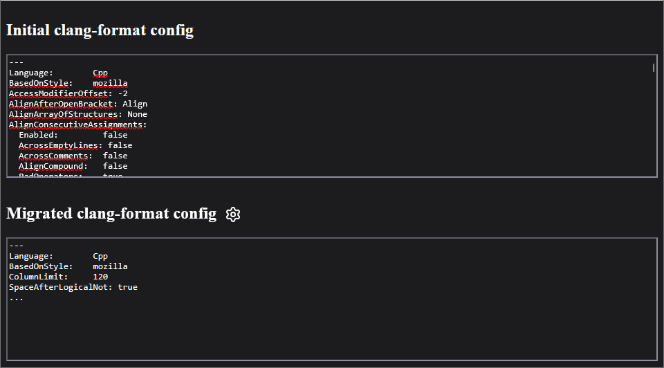
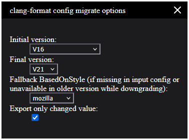

# Read me

There is lots of online tools on Internet. But they usually have 2 bigs problems: [privacy](https://www.cyberhaven.com/blog/4-2-of-workers-have-pasted-company-data-into-chatgpt) and/or [ads](https://www.lemonde.fr/en/pixels/article/2025/12/13/how-french-spies-police-and-military-personnel-are-betrayed-by-advertising-data_6748453_13.html).

I developped some free and specific tools than can be easily deployed.

## Demos

### readability-identifier-naming

Demo to [configure `readability-identifier-naming` rule](https://naming-style.le-garrec.fr) for `clang-tidy`.

This tool simplifies the configuration of `readability-identifier-naming` rule for `clang-tidy`. It visually shows the priority hierarchy when multiple naming rules overlap.

The last configuration is stored in your local storage.

.

### clang-format

Demo to format your code with [clang-format](https://clang-format.le-garrec.fr).

Format your code with `clang-format` and import / edit your config file.

The clang-format's version is the latest supported by the other tools `clang-format-config`.

### clang-format config

Demo to [migrate your config file](https://clang-format-config.le-garrec.fr) of `clang-format` from a version to another.

Sometimes, you configure `clang-format` using the latest version on your computer but your CI doesn't support it. With this tool, you may migrate your config file from a version to another (higher or lower) and removes options whose values match the defaults.

### Demangler

Demo to [demangler](https://demangler.le-garrec.fr) your symbols.

Demangler (and `clang-format`) your symbols.

### Lighten

Demo to [lighten](https://lighten.le-garrec.fr) your numbers.

IEEE floating point sucks. It may prints `3.999999` / `4.0000001` instead of `4`. The only available option is to define a threshold on the number of consecutive trailing zeros or nines, beyond which the value is truncated.

